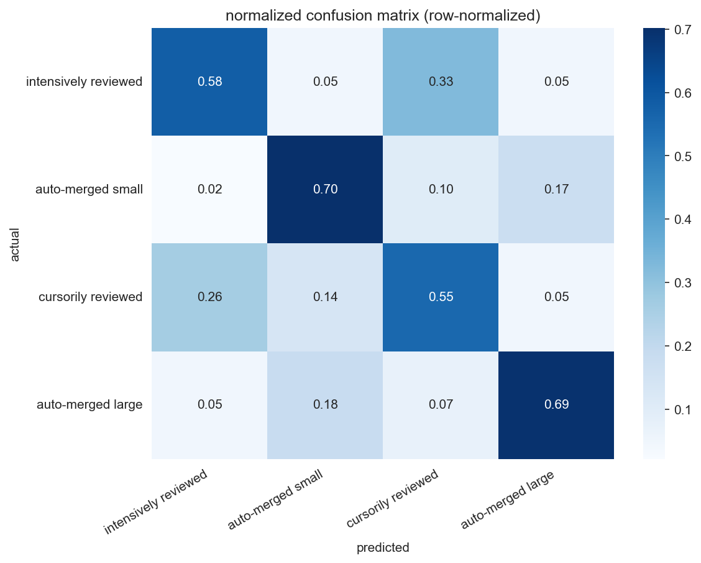

# cisc839 assignment 3

[](https://github.com/elsayedelmandoh/cisc839-assignment-3)

<p align="center">
  
  &nbsp; &nbsp;
  
</p>

## table of contents

- [overview](#overview)
- [key features](#key-features)
- [setup](#setup)
- [usage](#usage)
- [author](#author)

## overview

This project analyzes pull request review effort patterns in open-source repositories from the MSR 2026 Mining Challenge. The analysis identifies natural groups in agentic PRs based on review effort and predicts effort groups from PR descriptions.

The dataset contains GitHub pull requests authored by human developers and AI coding agents. The approach combines clustering (K-means) for label discovery with text classification (TF-IDF + Logistic Regression) for predicting effort groups from PR descriptions.

Key results: K-means with k=4 achieves silhouette=0.395 and identifies four distinct effort profiles. Text classification achieves macro-F1=0.597 on imbalanced 4-class classification.

## key features

- **effort dimension engineering**: Five domain-distinct dimensions derived from the dataset (time_to_merge_hours, n_formal_reviews, n_review_comments, n_unique_reviewers, churn_per_review_cycle).
- **k-means clustering**: Justified choice over GMM and DBSCAN for zero-inflated data. Selection of k=4 balances silhouette score with domain interpretability.
- **tf-idf classification**: Text representation with bigrams, Logistic Regression with class_weight=balanced for handling 5-45% class imbalance.
- **ai prompt documentation**: Excel file tracking all AI-assisted decisions with purpose, prompt, and evaluation.

## setup

### 0. prerequisites

- conda installed
- git installed

### 1. clone the repository

```bash
git clone https://github.com/anomalyco/cisc839-assignment-3.git
cd cisc839-assignment-3
```

### 2. create conda environment

```bash
conda create -n dataqueens python=3.12 -y
conda activate dataqueens
pip install -r requirements.txt
```

### 3. environment variables

create a `.env` file with any required variables. see `.env.example` for reference.

## usage

```bash
jupyter notebook notebooks/
```

run notebooks in order:
1. `01-data-loading-and-prep.ipynb`
2. `02-task1.1-effort-dimensions.ipynb`
3. `03-task1.2-clustering.ipynb`
4. `04-task2.1-2.2-classification.ipynb`
5. `05-task2.3-error-analysis.ipynb`
6. `06-task3-genai-reflection.ipynb`

## author

elsayed elmandoh - nlp engineer

* connect on linkedin and x [linktree](https://linktr.ee/elsayedelmandoh)