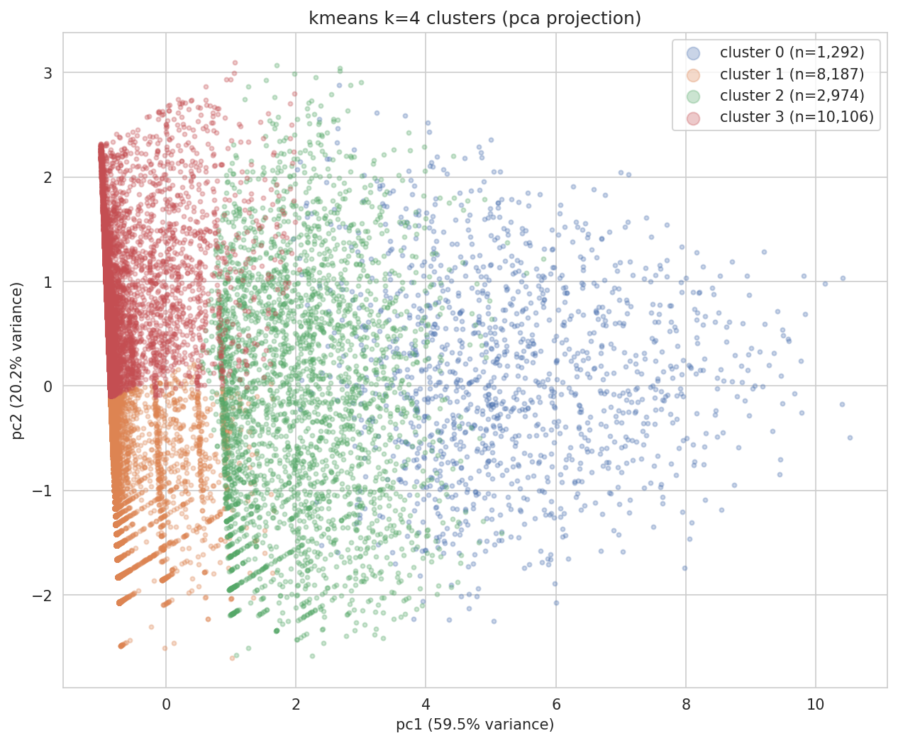

# assignment 3 | cisc839 | elsayed elmandoua | 25xrvl: 20596379

## part 1 - clustering design and analysis (30%)

### task 1.1: review effort dimensions

we define five dimensions on 22,559 agentic prs (human prs excluded: zero review data and nan churn create fillna(0) bias from a1, producing a trivial human-vs-agentic split rather than meaningful effort groups).

| dim | label | formula | % zeros |
|---|---|---|---|
| `time_to_merge_hours` | duration | `(merged_at - created_at) / 3600` | 0% |
| `n_formal_reviews` | iterations | `pr_reviews.groupby('pr_id').size()` | 77% |
| `n_review_comments` | depth | `pr_review_comments.groupby('pr_id').size()` | 89% |
| `n_unique_reviewers` | breadth | `pr_reviews[user_type=='User'].groupby('pr_id')['user'].nunique()` | 83% |
| `churn_per_review_cycle` | burden | `total_churn / max(n_formal_reviews, 1)` | 0.1% |

**duration** measures temporal extent. orthogonal to counts: a pr can have 8 reviews in 1 hour or 1 review over 30 days. long duration may indicate complexity or disagreement; short suggests quick consensus. **iterations** measures procedural complexity - how many formal rounds occurred. distinct from duration (a pr can sit unreviewed for days) and depth (one round can have many or zero comments). **depth** measures granularity of feedback - detailed line-by-line scrutiny vs rubber-stamp approvals. **breadth** measures reviewer diversity - 5 reviews from 1 reviewer (iterative refinement) vs 5 from 5 reviewers (broad community scrutiny). this replaced ai's initial `review_intensity` (comments/hour) which had rho=0.996 with depth - redundant because median duration is 0.04h, making comments/hour proportional to raw count. **burden** measures cognitive load per review round - 500 lines/review vs 50 lines/review differs substantially even with identical iteration counts. this dimension is essentially independent of all count metrics (|rho|<0.11), capturing a genuinely distinct axis.

**preprocessing:** log1p + standardscaler. (1) compresses extreme right tails (all dims: max >> median); (2) log1p(0)=0, critical for 77-89% zero dims where log(x) would need imputation; (3) reduces scale differences across mixed units; (4) zeros remain interpretable ("no review activity"). no pair exceeds rho=0.9 (highest: iterations x breadth = 0.863, moderate, capturing distinct aspects of procedural rounds vs reviewer diversity).

---

### task 1.2: clustering algorithm and cluster profiles

**algorithm:** k-means. dbscan excluded: zero-spike on 3 of 5 dims creates one massive cluster + noise. gmm excluded: outperformed by k-means on all metrics for k>=3 (k=4: sil 0.395 vs 0.091, dbi 0.997 vs 2.466) because the sharp zero-spike violates gmm's gaussian assumption.

**acceptable performance:** two named metrics with defended thresholds: (1) **silhouette >= 0.30** - "reasonable" structure per kaufman & roeusseeuw (1990); (2) **dbi <= 1.50** - accommodates zero-inflated overlap. all k=2..8 meet both thresholds.

**k=4** chosen over k=2 (sil=0.618 but trivial reviewed/not-reviewed split). k=4 separates unreviewed prs into small vs large churn sub-groups: 45% of prs are large unreviewed code additions. k=3 does not capture this split. final: sil=0.395, dbi=0.997, ch=15,310.

**cluster 0: "intensively reviewed" (n=1,292, 5.7%)** - med: duration 23.7h, iterations 5, depth 5, breadth 2, burden 38 lines. ranges: duration [0.004, 1,798h], iterations [1, 30], depth [1, 63]. task types: feat 38%, fix 27%. agents: copilot 54%, devin 20%, codex 19% - copilot overrepresentation consistent with a1's finding that copilot requires more review effort. the only cluster with substantial review. distinguished from cluster 2 by depth (5 vs 0) and iterations (5 vs 1).

**cluster 1: "auto-merged small" (n=8,187, 36.3%)** - med: duration 0.013h, iterations 0, depth 0, breadth 0, burden 16 lines [0, 55]. task types: fix 31%, feat 26%, docs 22% - small routine changes. agents: codex 90%. zero review, small code. distinguished from cluster 3 by 10x smaller burden (16 vs 165).

**cluster 2: "cursorily reviewed" (n=2,974, 13.2%)** - med: duration 4.5h, iterations 1, depth 0, breadth 1, burden 41 lines. task types: fix 36%, feat 29%. agents: devin 34%, codex 29%, copilot 27% - most balanced distribution, capturing a general "light review" pattern. some review but not deep - procedural rather than analytical.

**cluster 3: "auto-merged large" (n=10,106, 44.8%)** - med: duration 0.018h, iterations 0, depth 0, breadth 0, burden 165 lines [43, 3,123]. task types: feat 60% - predominantly feature additions bypassing review. agents: codex 89%. minimum churn of 43 lines flags substantial unreviewed code additions - a serious code quality concern affecting nearly half of all prs.

---

## part 2 - text-based label prediction (40%)

### task 2.1: classification pipeline

**text source:** pr descriptions (99.3% non-empty). expected signals: cluster 1 - short, fix/docs keywords, dependency boilerplate; cluster 3 - feature descriptions, feat vocabulary, implementation details; cluster 2 - fix/refactor keywords, moderate length; cluster 0 - architectural terms, breaking change mentions. preprocessing is needed because descriptions contain markdown, code blocks, auto-generated urls, and bot signatures that introduce noise.

**preprocessing:** lowercase, strip code blocks/urls/markdown, remove punctuation, collapse whitespace. verified on samples that bot content is removed while technical terms are preserved.

**method:** tf-idf (unigrams+bigrams, 5k features, min_df=3, max_df=0.95) + logistic regression (class_weight='balanced'). bigrams capture phrases like "breaking change." max_features=5,000 controls dimensionality; min_df=3 removes rare terms; max_df=0.95 removes corpus-wide stop words. lr chosen over linear svc: macro-f1 0.597 vs 0.575, plus interpretable coefficients. class_weight='balanced' handles severe imbalance (5.7%-44.8%). vocabulary: 5,000 terms; sparsity: 99.0%.

---

### task 2.2: evaluation

stratified 80/20 split (train: 17,928; test: 4,483) preserving class ratios - critical because cluster 0 is only 5.7%.

| cluster | label | prec | recall | f1 | n |
|---|---|---|---|---|---|
| 0 | intensively reviewed | 0.34 | 0.58 | 0.43 | 257 |
| 1 | auto-merged small | 0.71 | 0.70 | 0.71 | 1,630 |
| 2 | cursorily reviewed | 0.45 | 0.55 | 0.50 | 589 |
| 3 | auto-merged large | 0.81 | 0.69 | 0.75 | 2,007 |
| | **macro avg** | **0.58** | **0.63** | **0.60** | **4,483** |

accuracy=0.67 is insufficient (naive majority = 44.8%). macro-f1 and per-class metrics treat each class equally. cluster 0 has lowest f1 (0.43) due to small size and textual overlap with cluster 2; cluster 3 highest (0.75) with distinctive feat vocabulary. confusion matrix: largest off-diagonal errors are c1<->c3 (282+369=651, 14.5% of test) and c0<->c2 (84+154=238). the single largest error direction is c3->c1 (369): classifier predicts "auto-merged small" when true label is "auto-merged large."

---

### task 2.3: error analysis and cluster quality reflection

**most confused pair:** clusters 1 (auto-merged small) and 3 (auto-merged large) - 651 bidirectional errors (14.5%). dominant direction: c3->c1 (369 errors); reverse: 282.

**root cause:** clusters 1 and 3 differ only in code volume (burden med 16 vs 165), not in review activity (both: zero reviews, zero comments, zero reviewers, near-zero duration). churn is a code-level metric invisible to text classification.

**quantitative evidence:** mann-whitney u test on churn for correctly classified c3 vs misclassified c3->c1: u=358,335, p=2.85e-31. misclassified prs have significantly lower churn (median 94 vs 181), sitting near the cluster boundary. task type overlap: cluster 1 is 26% feat, cluster 3 is 60% feat, but misclassified c3->c1 prs have feat proportion closer to cluster 1.

**textual evidence:** e.g., a c3->c1 error (churn=843 lines) starts with "summary create a small offline build script" - "small" suggests minor changes yet code volume is large. a c1->c3 error (churn=40 lines) starts with "summary update php transpiler to support jsonl loading" - sounds feature-like but the change is small. misclassified prs use similar language regardless of code volume.

**reflection:** (1) the 4-cluster solution may over-split the "no review" population (81% of prs); a 3-cluster merge of 1+3 would be more textually separable but loses the small/large distinction. (2) the clustering captures structurally different variation: clusters 0/2 separated by review behavior (reflected in text), clusters 1/3 separated by code volume (invisible to text). (3) the clustering remains meaningful: sil=0.395 and dbi=0.997 confirm genuine structure, and the small/large distinction flags 45% of prs as large unreviewed additions.

---

## part 3 - genai-augmented reflection (30%)

### task 3.1: ai usage documentation

| # | decision | part | accepted | evaluation |
|---|---|---|---|---|
| 1 | filter to agentic-only prs | p1 | yes | verified human prs have zero review data; including them creates trivial split |
| 2 | define 5 effort dimensions | p1 | partial | rejected review_intensity (rho=0.996 with depth); replaced with n_unique_reviewers (rho=0.863 with iterations) |
| 3 | kmeans over gmm/dbscan | p1 | yes | sweeps k=2..8; kmeans outperformed gmm on all metrics for k>=3 |
| 4 | k=4 over k=2 (highest sil) | p1 | yes | k=2 trivial; k=4 reveals 45% prs are large unreviewed code |
| 5 | tf-idf + logistic regression | p2 | yes | lr macro-f1=0.597 vs svc=0.575; interpretable coefficients |
| 6 | strip markdown/code/urls | p2 | yes | inspected samples; bot content removed, technical terms preserved |

**representative prompts:** (1) "human prs have no review data. should i include them in clustering or filter to agentic-only?" (2) "what are unique dimensions of review effort? i need dimensions that capture distinct aspects." (3) "my clustering data has 77-89% zeros on 3 of 5 dims. which algorithm handles zero-inflated data best?" (4) "k=2 has the best silhouette but seems too simple. how should i balance silhouette with interpretability?" (5) "what is the best approach for classifying pr descriptions into 4 clusters with severe imbalance?" (6) "pr descriptions contain markdown, code blocks, urls. how should i clean them for tf-idf?"

**most meaningful iterative refinement: decision 2.** ai initially suggested `review_intensity` (comments/hour) as the 4th dimension, capturing "concentration" of review effort. this seemed reasonable on domain grounds. however, after computing the spearman correlation matrix, review_intensity and n_review_comments had rho=0.996 - nearly identical because most prs have very short durations (median 0.04h), making comments/hour essentially proportional to raw comment count. including both would violate the requirement that each dimension capture a unique aspect.

i rejected review_intensity and replaced it with n_unique_reviewers (distinct human reviewers per pr), capturing "breadth" of reviewer involvement. the spearman correlation with n_formal_reviews was 0.863 (moderate, not extreme), and no pair in the revised set exceeded rho=0.9. this refinement is analytically meaningful: it replaces a redundant dimension with one capturing a genuinely distinct effort aspect (reviewer diversity vs procedural iterations). the key validation was running a quantitative correlation test rather than accepting the ai's domain reasoning at face value.

---
